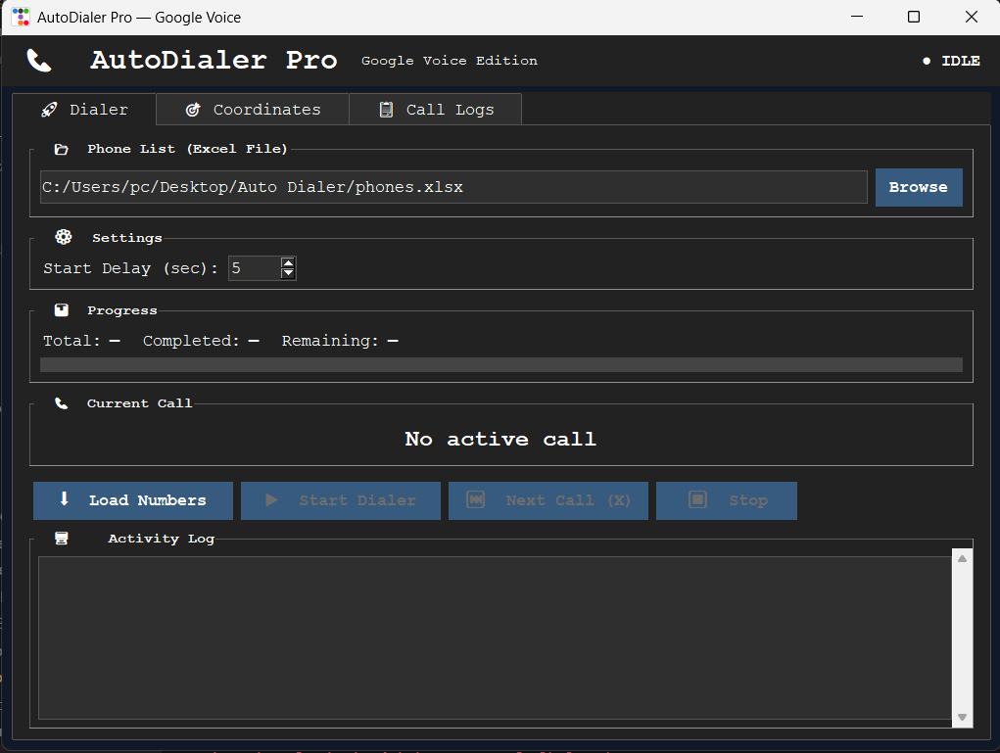
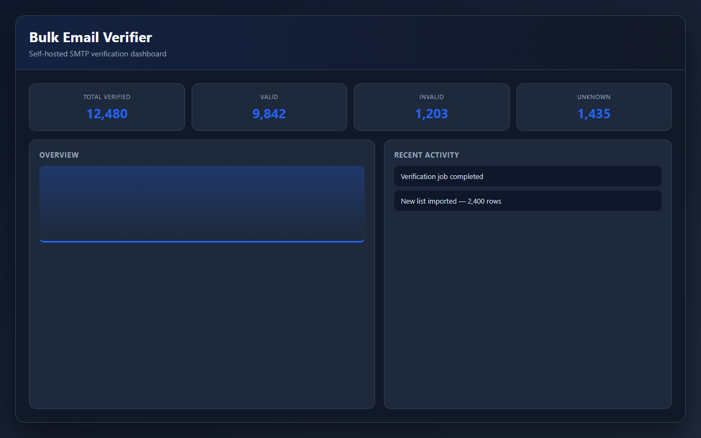
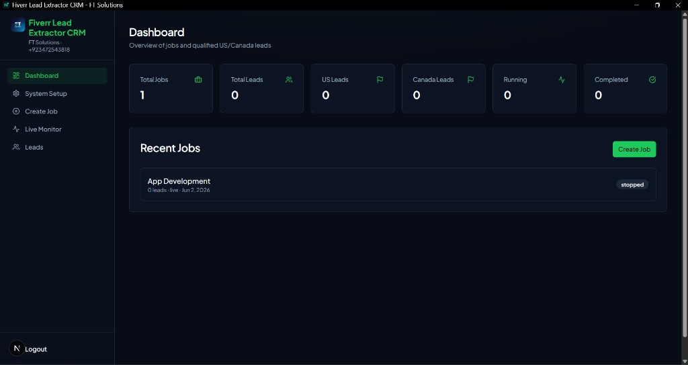
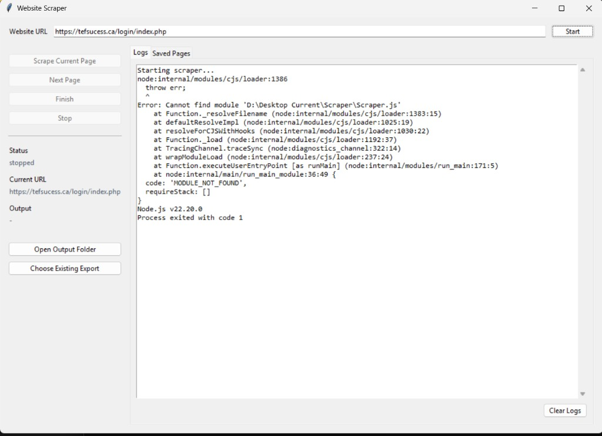

<div align="center">


<br/><br/>

[](#-work-with-me)
[](https://mafzalkalwardev.github.io)
[](https://mafzalkalwardev.github.io/assets/Muhammad-Afzal-Kalwar-CV.pdf)

<br/>

[](https://github.com/mafzalkalwardev)
[](https://www.linkedin.com/in/muhammad-afzal-2670b527b/)
[](mailto:kalwarmuhammadafzal3@gmail.com)
[](#-about-me)

<br/>


</div>

---

## 👨‍💻 About Me

I'm **Muhammad Afzal Kalwar** — a **Full-Stack Developer** and **Automation Engineer** from **Islamabad, Pakistan**, building production software for logistics, CRM, email, and AI-powered workflows.

I graduated with a **B.S. in Computer Science from Air University, Islamabad**, and ship real products across **Python desktop apps**, **React/Node.js web platforms**, and **Playwright/Selenium automation** — with **40+ open source repositories** as proof of work.

| Focus | What I deliver |
|:------|:---------------|
| **Web & SaaS** | React · Next.js · Node.js · FastAPI · MongoDB · auth & dashboards |
| **Python & desktop** | PyQt6 Windows apps · scripts · Excel pipelines · internal tools |
| **Automation** | Playwright · Selenium · FMCSA scrapers · CRM integrations |
| **Communications** | Google Voice dialers · SMTP · bulk email verification |
| **AI & voice** | Whisper · Groq · call analytics · ML prototypes |

---

## 🎓 Education

<table>
<tr>
<td width="72" valign="top">

</td>
<td valign="top">

**Bachelor of Science in Computer Science** · **Air University, Islamabad** · *Graduated*

Algorithms · software engineering · databases · operating systems · computer networks · systems programming

</td>
</tr>
</table>

---

## 💼 Work With Me

| | |
|---|---|
| **Roles** | Full-Stack Developer · Python Engineer · Automation Engineer |
| **Engagement** | Freelance · Contract · Part-time · Full-time remote |
| **Location** | Islamabad, Pakistan — **remote worldwide** |
| **Portfolio** | [mafzalkalwardev.github.io](https://mafzalkalwardev.github.io) |
| **Contact** | [Email](mailto:kalwarmuhammadafzal3@gmail.com) · [LinkedIn](https://www.linkedin.com/in/muhammad-afzal-2670b527b/) |

**Typical projects:** auto dialers · email verification · web scrapers · SaaS dashboards · CRM tools · dispatch websites · API integrations · Excel/data automation

---

## 🚀 Featured Projects

<table>
<tr>
<td width="50%" valign="top">

### 📞 [Indus Transport Auto Dialer](https://github.com/mafzalkalwardev/indus-transport-auto-dialer)



Production Windows dialer — Google Voice, AMD, predictive pacing, CRM, Excel lists.

`Python` `PyQt6` `Whisper` `SQLite`

</td>
<td width="50%" valign="top">

### 📧 [Bulk Email Verifier](https://github.com/mafzalkalwardev/bulk-email-verifier)



Self-hosted verification — syntax, MX, SMTP checks. Go + Node.js, Docker-ready.

`Go` `Node.js` `Docker`

</td>
</tr>
<tr>
<td width="50%" valign="top">

### 🎯 [Fiverr Lead Extractor CRM](https://github.com/mafzalkalwardev/fiverr-lead-extractor-crm)



Playwright extraction · MongoDB · BullMQ · Excel export · admin panel.

`TypeScript` `Next.js` `Playwright`

</td>
<td width="50%" valign="top">

### 📊 [CallAudit-X](https://github.com/mafzalkalwardev/CallAudit-X)


AI call auditing, transcription, scoring, and analytics SaaS platform.

`TypeScript` `Next.js` `AI`

</td>
</tr>
<tr>
<td width="50%" valign="top">

### 🤖 [Google Voice Dispatch Agent](https://github.com/mafzalkalwardev/google-voice-dispatch-agent)


Selenium automation · Groq scripts · voicemail detection · local TTS.

`Python` `Selenium` `Groq`

</td>
<td width="50%" valign="top">

### 🕷 [Playwright Scraper Pro](https://github.com/mafzalkalwardev/playwright-website-scraper-pro)



Multi-page scraper with GUI, asset download, and export.

`Playwright` `Node.js` `Express`

</td>
</tr>
</table>

👉 **[View all 38 projects on my portfolio →](https://mafzalkalwardev.github.io/projects.html)**

---

## 🗺 Current Learning Roadmap

<div align="center">


</div>

| Quarter | Focus | Topics |
|:--------|:------|:-------|
| **Q1** | Production automation | PyQt6 dialers · Google Voice · AMD · campaign reliability |
| **Q2** | Full-stack SaaS | TypeScript · React/Next.js · MongoDB · auth & billing |
| **Q3** | AI & voice tech | Whisper · Groq agents · CallAudit-X · call analytics |
| **Q4** | DevOps & scale | Docker · CI/CD · monitoring · load testing · Kubernetes |

---

## 🛠 Tech Stack

<div align="center">

**Languages**


**Frontend & desktop**


**Backend & data**


**Automation, AI & DevOps**


<br/>


</div>

---

## 📦 Repository Highlights

| Category | Projects |
|----------|----------|
| **Dialers & voice** | [indus-transport-auto-dialer](https://github.com/mafzalkalwardev/indus-transport-auto-dialer) · [google-voice-dispatch-agent](https://github.com/mafzalkalwardev/google-voice-dispatch-agent) |
| **Email platforms** | [bulk-email-verifier](https://github.com/mafzalkalwardev/bulk-email-verifier) · [mailforge](https://github.com/mafzalkalwardev/mailforge) |
| **Web & CRM** | [fiverr-lead-extractor-crm](https://github.com/mafzalkalwardev/fiverr-lead-extractor-crm) · [CallAudit-X](https://github.com/mafzalkalwardev/CallAudit-X) |
| **Scrapers** | [playwright-website-scraper-pro](https://github.com/mafzalkalwardev/playwright-website-scraper-pro) · [fmcsa-safer-scraper](https://github.com/mafzalkalwardev/fmcsa-safer-scraper) |
| **All repos** | [**Browse 40+ repositories →**](https://github.com/mafzalkalwardev?tab=repositories) |

---

## 📈 GitHub Stats

<div align="center">


<br/>


<br/>


</div>

---

## 🐍 Contribution Snake

<div align="center">

<picture>
  <source media="(prefers-color-scheme: dark)" srcset="https://raw.githubusercontent.com/mafzalkalwardev/mafzalkalwardev/output/github-contribution-grid-snake-dark.svg" />
  <source media="(prefers-color-scheme: light)" srcset="https://raw.githubusercontent.com/mafzalkalwardev/mafzalkalwardev/output/github-contribution-grid-snake.svg" />
  
</picture>

</div>

---

## 💻 At a Glance

```python
class MuhammadAfzalKalwar:
    name = "Muhammad Afzal Kalwar"
    title = "Full-Stack Developer & Automation Engineer"
    education = "B.S. Computer Science — Air University, Islamabad"
    location = "Islamabad, Pakistan · Remote worldwide"
    status = "Open to freelance, contract, and remote roles"

    stack = [
        "Python", "TypeScript", "Go", "React", "Node.js",
        "PyQt6", "Playwright", "Docker", "MongoDB", "FastAPI",
    ]

    portfolio = "https://mafzalkalwardev.github.io"

    def contact(self):
        return "mailto:kalwarmuhammadafzal3@gmail.com"
```

---

<div align="center">

<h2><strong>⚡ Building systems that automate workflows and solve real-world business problems.</strong></h2>


**Let's build something useful — [email me](mailto:kalwarmuhammadafzal3@gmail.com) · [portfolio](https://mafzalkalwardev.github.io) · [LinkedIn](https://www.linkedin.com/in/muhammad-afzal-2670b527b/)**


</div>

<details>
<summary><strong>Search index</strong></summary>

<br/>

Muhammad Afzal Kalwar · mafzalkalwardev · Python developer · full-stack developer · automation engineer · freelance developer · remote developer · Islamabad Pakistan · Air University · auto dialer · email verification · Playwright · PyQt6

| Project | Repository |
|---------|------------|
| Auto Dialer | [indus-transport-auto-dialer](https://github.com/mafzalkalwardev/indus-transport-auto-dialer) |
| Email Verifier | [bulk-email-verifier](https://github.com/mafzalkalwardev/bulk-email-verifier) |
| GV Agent | [google-voice-dispatch-agent](https://github.com/mafzalkalwardev/google-voice-dispatch-agent) |
| Fiverr CRM | [fiverr-lead-extractor-crm](https://github.com/mafzalkalwardev/fiverr-lead-extractor-crm) |
| CallAudit-X | [CallAudit-X](https://github.com/mafzalkalwardev/CallAudit-X) |
| Scraper Pro | [playwright-website-scraper-pro](https://github.com/mafzalkalwardev/playwright-website-scraper-pro) |

</details>

---

## GitHub Packages

Docker images for all projects are published to **GitHub Container Registry (GHCR)** on release.


| Repository | Pull |
|------------|------|
| [ft-solutions-hub](https://github.com/mafzalkalwardev/ft-solutions-hub) | `ghcr.io/mafzalkalwardev/ft-solutions-hub:latest` |
| [professional-portfolio](https://github.com/mafzalkalwardev/professional-portfolio) | `ghcr.io/mafzalkalwardev/professional-portfolio:latest` |
| [rdp](https://github.com/mafzalkalwardev/rdp) | `ghcr.io/mafzalkalwardev/rdp:latest` |
| [dev](https://github.com/mafzalkalwardev/dev) | `ghcr.io/mafzalkalwardev/dev:latest` |
| [fiverr-lead-extractor-crm](https://github.com/mafzalkalwardev/fiverr-lead-extractor-crm) | `ghcr.io/mafzalkalwardev/fiverr-lead-extractor-crm:latest` |
| [kb-transport-llc-website](https://github.com/mafzalkalwardev/kb-transport-llc-website) | `ghcr.io/mafzalkalwardev/kb-transport-llc-website:latest` |
| [python-sms-automation](https://github.com/mafzalkalwardev/python-sms-automation) | `ghcr.io/mafzalkalwardev/python-sms-automation:latest` |
| [indus-transport-auto-dialer](https://github.com/mafzalkalwardev/indus-transport-auto-dialer) | `ghcr.io/mafzalkalwardev/indus-transport-auto-dialer:latest` |
| [quizmaster-online-testing-system](https://github.com/mafzalkalwardev/quizmaster-online-testing-system) | `ghcr.io/mafzalkalwardev/quizmaster-online-testing-system:latest` |
| [python-smtp-email-automation](https://github.com/mafzalkalwardev/python-smtp-email-automation) | `ghcr.io/mafzalkalwardev/python-smtp-email-automation:latest` |
| [playwright-website-scraper-pro](https://github.com/mafzalkalwardev/playwright-website-scraper-pro) | `ghcr.io/mafzalkalwardev/playwright-website-scraper-pro:latest` |
| [email-verification-platform](https://github.com/mafzalkalwardev/email-verification-platform) | `ghcr.io/mafzalkalwardev/email-verification-platform:latest` |
| [python-auto-dialer-pro](https://github.com/mafzalkalwardev/python-auto-dialer-pro) | `ghcr.io/mafzalkalwardev/python-auto-dialer-pro:latest` |
| [safer-carrier-extractor](https://github.com/mafzalkalwardev/safer-carrier-extractor) | `ghcr.io/mafzalkalwardev/safer-carrier-extractor:latest` |
| [dat-stream-studio](https://github.com/mafzalkalwardev/dat-stream-studio) | `ghcr.io/mafzalkalwardev/dat-stream-studio:latest` |
| [quickdraw-test](https://github.com/mafzalkalwardev/quickdraw-test) | `ghcr.io/mafzalkalwardev/quickdraw-test:latest` |
| [portfilio](https://github.com/mafzalkalwardev/portfilio) | `ghcr.io/mafzalkalwardev/portfilio:latest` |
| [mnist-cnn-digit-recognition](https://github.com/mafzalkalwardev/mnist-cnn-digit-recognition) | `ghcr.io/mafzalkalwardev/mnist-cnn-digit-recognition:latest` |
| [excel-call-queue-automator](https://github.com/mafzalkalwardev/excel-call-queue-automator) | `ghcr.io/mafzalkalwardev/excel-call-queue-automator:latest` |
| [safer-web-scraper](https://github.com/mafzalkalwardev/safer-web-scraper) | `ghcr.io/mafzalkalwardev/safer-web-scraper:latest` |
| [usa-truck-connect](https://github.com/mafzalkalwardev/usa-truck-connect) | `ghcr.io/mafzalkalwardev/usa-truck-connect:latest` |
| [LearningDashboard](https://github.com/mafzalkalwardev/LearningDashboard) | `ghcr.io/mafzalkalwardev/LearningDashboard:latest` |
| [one-stop-car-care-website](https://github.com/mafzalkalwardev/one-stop-car-care-website) | `ghcr.io/mafzalkalwardev/one-stop-car-care-website:latest` |
| [clientreadyftsolutionsdombom](https://github.com/mafzalkalwardev/clientreadyftsolutionsdombom) | `ghcr.io/mafzalkalwardev/clientreadyftsolutionsdombom:latest` |
| [bulk-email-verifier](https://github.com/mafzalkalwardev/bulk-email-verifier) | `ghcr.io/mafzalkalwardev/bulk-email-verifier:latest` |
| [google-voice-dispatch-agent](https://github.com/mafzalkalwardev/google-voice-dispatch-agent) | `ghcr.io/mafzalkalwardev/google-voice-dispatch-agent:latest` |
| [devops](https://github.com/mafzalkalwardev/devops) | `ghcr.io/mafzalkalwardev/devops:latest` |
| [online-food-delivery](https://github.com/mafzalkalwardev/online-food-delivery) | `ghcr.io/mafzalkalwardev/online-food-delivery:latest` |
| [multi-smtp-email-automation](https://github.com/mafzalkalwardev/multi-smtp-email-automation) | `ghcr.io/mafzalkalwardev/multi-smtp-email-automation:latest` |
| [mouse-coordinate-tracker](https://github.com/mafzalkalwardev/mouse-coordinate-tracker) | `ghcr.io/mafzalkalwardev/mouse-coordinate-tracker:latest` |
| [fmcsa-safer-scraper](https://github.com/mafzalkalwardev/fmcsa-safer-scraper) | `ghcr.io/mafzalkalwardev/fmcsa-safer-scraper:latest` |
| [excel-state-extractor-formula](https://github.com/mafzalkalwardev/excel-state-extractor-formula) | `ghcr.io/mafzalkalwardev/excel-state-extractor-formula:latest` |
| [forward-email-automation](https://github.com/mafzalkalwardev/forward-email-automation) | `ghcr.io/mafzalkalwardev/forward-email-automation:latest` |
| [CallAudit-X](https://github.com/mafzalkalwardev/CallAudit-X) | `ghcr.io/mafzalkalwardev/CallAudit-X:latest` |
| [email-verifier-pro](https://github.com/mafzalkalwardev/email-verifier-pro) | `ghcr.io/mafzalkalwardev/email-verifier-pro:latest` |
| [Canadian-Website-Scraper](https://github.com/mafzalkalwardev/Canadian-Website-Scraper) | `ghcr.io/mafzalkalwardev/Canadian-Website-Scraper:latest` |
| [pdf-mc-number-extractor](https://github.com/mafzalkalwardev/pdf-mc-number-extractor) | `ghcr.io/mafzalkalwardev/pdf-mc-number-extractor:latest` |
| [mywebpagetask](https://github.com/mafzalkalwardev/mywebpagetask) | `ghcr.io/mafzalkalwardev/mywebpagetask:latest` |
| [devops2](https://github.com/mafzalkalwardev/devops2) | `ghcr.io/mafzalkalwardev/devops2:latest` |
| [excel-mc-data-cleaner](https://github.com/mafzalkalwardev/excel-mc-data-cleaner) | `ghcr.io/mafzalkalwardev/excel-mc-data-cleaner:latest` |
| [indus-transports-dispatch-website](https://github.com/mafzalkalwardev/indus-transports-dispatch-website) | `ghcr.io/mafzalkalwardev/indus-transports-dispatch-website:latest` |
| [mailforge](https://github.com/mafzalkalwardev/mailforge) | `ghcr.io/mafzalkalwardev/mailforge:latest` |
| [odysseus](https://github.com/mafzalkalwardev/odysseus) | `ghcr.io/mafzalkalwardev/odysseus:latest` |

```bash
docker pull ghcr.io/mafzalkalwardev/mailforge:latest
```

---

## GitHub Trophies


## Stats


