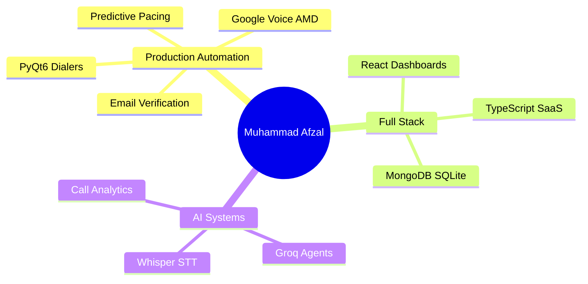

<div align="center">


<br/>

[](https://github.com/mafzalkalwardev)
[](https://www.linkedin.com/in/muhammad-afzal-2670b527b/)
[](mailto:kalwarmuhammadafzal3@gmail.com)
[](https://mafzalkalwardev.github.io)
[](https://github.com/mafzalkalwardev?tab=repositories)

<br/>


</div>

---

<table>
<tr>
<td width="62%" valign="top">

## 👨‍💻 About Me

I'm **Muhammad Afzal Kalwar** — **Full-Stack Developer** & **Automation Engineer** at **FT Solutions** (Islamabad, Pakistan).

I build production software that automates real business workflows: multi-line Google Voice dialers, self-hosted email verification, CRM systems, scrapers, and logistics tooling.

**What I ship**

| Area | From my repos |
|------|---------------|
| 📞 **Telephony** | PyQt6 dialers · AMD · predictive pacing · Google Voice |
| 📧 **Email** | Bulk verification (Go + Node) · SMTP · MailForge |
| 🕷 **Automation** | Playwright · Selenium · FMCSA/SAFER · lead CRMs |
| 🌐 **Web & SaaS** | React/TS dashboards · dispatch sites |
| 🧠 **AI / ML** | Whisper · Groq agents · CallAudit · TensorFlow |
| 📊 **Data** | pandas · openpyxl · VBA · PDF extractors |

</td>
<td width="38%" align="center" valign="middle">


<br/>

<sub><em>Shipping automation, one commit at a time ⌨️</em></sub>

</td>
</tr>
</table>

---

## 🚀 Featured Projects

<table>
<tr>
<td width="50%" valign="top">

### 📞 [Indus Transport Auto Dialer](https://github.com/mafzalkalwardev/indus-transport-auto-dialer)

Production Windows dialer for transport operations.

* Multi-line Google Voice · AMD · predictive pacing
* CRM (SQLite) · Excel lists · WebSocket supervisor

**Stack:** `Python` `PyQt6` `Whisper` `WebSockets`

</td>
<td width="50%" valign="top">

### 📧 [Bulk Email Verifier](https://github.com/mafzalkalwardev/bulk-email-verifier)

Self-hosted bulk email verification — no paid APIs.

* Syntax · MX · live SMTP dialog
* Go + Node.js · Docker · CSV export

**Stack:** `Go` `Node.js` `Docker` `SMTP`

</td>
</tr>
<tr>
<td width="50%" valign="top">

### 🤖 [Google Voice Dispatch Agent](https://github.com/mafzalkalwardev/google-voice-dispatch-agent)

AI sales agent on Google Voice.

* Selenium · Groq scripts · voicemail detection
* Local TTS · CRM call workflows

**Stack:** `Python` `FastAPI` `Selenium` `Groq`

</td>
<td width="50%" valign="top">

### 🎯 [Fiverr Lead Extractor CRM](https://github.com/mafzalkalwardev/fiverr-lead-extractor-crm)

Fiverr scraping and CRM platform.

* Playwright · MongoDB · Excel export
* Resume/retry · verification workflows

**Stack:** `TypeScript` `Playwright` `MongoDB`

</td>
</tr>
<tr>
<td width="50%" valign="top">

### 📊 [CallAudit-X](https://github.com/mafzalkalwardev/CallAudit-X)

AI call auditing and analytics.

* Transcription · scoring · SaaS dashboards

**Stack:** `TypeScript` `AI pipelines`

</td>
<td width="50%" valign="top">

### ✉️ [MailForge](https://github.com/mafzalkalwardev/mailforge)

Email tooling and automation backend.

* SMTP workflows · templates · Go services

**Stack:** `Go` `SMTP`

</td>
</tr>
</table>

---

## 🛠 Tech Stack

<div align="center">

*Languages, frameworks & tools across **40+ open source repositories***

</div>

<table>
<tr>
<td width="50%" valign="top">

**Languages**


**Frontend & Desktop**


<sub>PyQt6 · QWebEngine · Tkinter · EJS · HTML/CSS</sub>

**Backend & APIs**


</td>
<td width="50%" valign="top">

**Databases & Data**


<sub>pandas · openpyxl · Excel/VBA · Jupyter</sub>

**Automation & AI**


<sub>PyAutoGUI · WebSockets · Whisper · Groq · AMD</sub>

**DevOps & Tools**


</td>
</tr>
</table>

<div align="center">


</div>

---

## 📦 Repository Highlights

| Category | Repositories |
|----------|--------------|
| **Dialers & voice** | [auto-dialer](https://github.com/mafzalkalwardev/indus-transport-auto-dialer) · [python-auto-dialer-pro](https://github.com/mafzalkalwardev/python-auto-dialer-pro) · [GV dispatch](https://github.com/mafzalkalwardev/google-voice-dispatch-agent) |
| **Email** | [bulk-email-verifier](https://github.com/mafzalkalwardev/bulk-email-verifier) · [mailforge](https://github.com/mafzalkalwardev/mailforge) · [smtp-automation](https://github.com/mafzalkalwardev/python-smtp-email-automation) |
| **Scraping** | [playwright-scraper](https://github.com/mafzalkalwardev/playwright-website-scraper-pro) · [safer-extractor](https://github.com/mafzalkalwardev/safer-carrier-extractor) · [Canadian scraper](https://github.com/mafzalkalwardev/Canadian-Website-Scraper) |
| **CRM & SaaS** | [CallAudit-X](https://github.com/mafzalkalwardev/CallAudit-X) · [fiverr-crm](https://github.com/mafzalkalwardev/fiverr-lead-extractor-crm) · [dat-stream](https://github.com/mafzalkalwardev/dat-stream-studio) |
| **Hub** | [ft-solutions-hub](https://github.com/mafzalkalwardev/ft-solutions-hub) · [portfolio site](https://mafzalkalwardev.github.io) |

---

## 📈 GitHub Analytics

<div align="center">


<br/>


<br/>


</div>

---

## 🧠 Current Focus



---

## 🐍 Contribution Graph

<div align="center">

<picture>
  <source media="(prefers-color-scheme: dark)" srcset="https://raw.githubusercontent.com/mafzalkalwardev/mafzalkalwardev/output/snake-dark.svg" />
  <source media="(prefers-color-scheme: light)" srcset="https://raw.githubusercontent.com/mafzalkalwardev/mafzalkalwardev/output/snake.svg" />
  
</picture>

</div>

---

## 💼 Engineering Profile

```python
class MuhammadAfzalKalwar:
    role = "Automation Engineer & Full-Stack Developer"
    org = "FT Solutions · Islamabad, PK"

    stack = ["Python", "Go", "Node.js", "TypeScript", "PyQt6", "Playwright", "Whisper"]

    def mission(self):
        return "Ship reliable automation that saves time and scales operations."
```

---

<div align="center">

### 🔍 Skills & Keywords


<br/><br/>


<br/>

**Building systems that automate workflows and solve real-world business problems.**

<br/>


</div>

---

<details>
<summary><strong>🔎 SEO & project index</strong> (click to expand)</summary>

<br/>

**Muhammad Afzal Kalwar** · **mafzalkalwardev** · Python developer · Automation engineer · Islamabad, Pakistan

Portfolio: **[mafzalkalwardev.github.io](https://mafzalkalwardev.github.io)**

| Project | Link |
|---------|------|
| Auto Dialer | [indus-transport-auto-dialer](https://github.com/mafzalkalwardev/indus-transport-auto-dialer) |
| Email Verifier | [bulk-email-verifier](https://github.com/mafzalkalwardev/bulk-email-verifier) |
| GV Dispatch | [google-voice-dispatch-agent](https://github.com/mafzalkalwardev/google-voice-dispatch-agent) |
| Fiverr CRM | [fiverr-lead-extractor-crm](https://github.com/mafzalkalwardev/fiverr-lead-extractor-crm) |
| CallAudit-X | [CallAudit-X](https://github.com/mafzalkalwardev/CallAudit-X) |
| MailForge | [mailforge](https://github.com/mafzalkalwardev/mailforge) |

</details>
