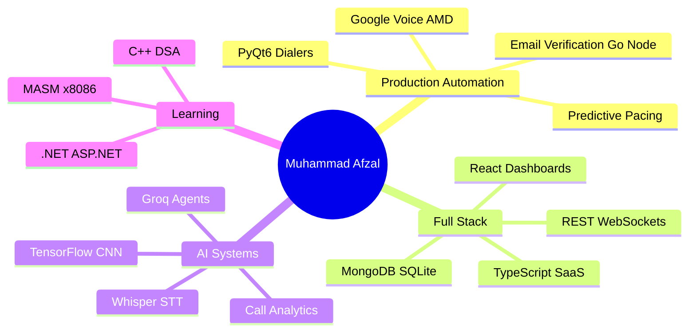

<div align="center">


<br/>

[](https://github.com/mafzalkalwardev)
[](https://www.linkedin.com/in/muhammad-afzal-2670b527b/)
[](mailto:kalwarmuhammadafzal3@gmail.com)
[](https://github.com/mafzalkalwardev?tab=repositories)
[](https://github.com/mafzalkalwardev)

<br/>


</div>

---

## 👨‍💻 About Me

I'm **Muhammad Afzal Kalwar**, a **Full-Stack Developer** and **Automation Engineer** at **FT Solutions**. I build production software that automates real business workflows — from multi-line Google Voice dialers and email verification platforms to CRM systems, scrapers, and logistics tooling.

**What I ship:**

| Area | Examples from my repos |
|------|------------------------|
| **Telephony & dialers** | PyQt6 auto dialers, AMD, predictive pacing, Google Voice integration |
| **Email systems** | Bulk verification (Go + Node), SMTP automation, MailForge |
| **Automation & scraping** | Playwright, Selenium, FMCSA/SAFER extractors, lead CRMs |
| **Web & dashboards** | React/TS SaaS, dispatch websites, learning dashboards |
| **AI / ML** | Call auditing, Whisper audio, TensorFlow CNN, Groq-assisted agents |
| **Data & Excel** | pandas, openpyxl, VBA cleaners, PDF MC extractors |

---

## 🚀 Featured Projects

<table>
<tr>
<td width="50%">

### 📞 [Indus Transport Auto Dialer](https://github.com/mafzalkalwardev/indus-transport-auto-dialer)

Production Windows dialer for transport operations.

* Multi-line Google Voice (`QWebEngineView`)
* AMD fusion · predictive pacing · CRM (SQLite)
* Excel lists · agent/admin roles · WebSocket supervisor

**Stack:** Python · PyQt6 · Whisper · WebSockets

</td>
<td width="50%">

### 📧 [Bulk Email Verifier](https://github.com/mafzalkalwardev/bulk-email-verifier)

Self-hosted bulk email verification — no paid APIs.

* Syntax · MX · live SMTP dialog
* Go + Node.js engines · Docker optional
* CSV export · self-hosted

**Stack:** Go · Node.js · Docker · SMTP

</td>
</tr>
<tr>
<td width="50%">

### 🤖 [Google Voice Dispatch Agent](https://github.com/mafzalkalwardev/google-voice-dispatch-agent)

AI sales agent on Google Voice.

* Selenium automation · Groq scripts
* Voicemail detection · local TTS
* CRM-style call workflows

**Stack:** Python · FastAPI · Selenium · Groq

</td>
<td width="50%">

### 🎯 [Fiverr Lead Extractor CRM](https://github.com/mafzalkalwardev/fiverr-lead-extractor-crm)

Fiverr scraping and CRM platform.

* Playwright automation · MongoDB
* Excel export · resume/retry
* Verification workflows

**Stack:** TypeScript · Playwright · MongoDB

</td>
</tr>
<tr>
<td width="50%">

### 📊 [CallAudit-X](https://github.com/mafzalkalwardev/CallAudit-X)

AI call auditing and analytics.

* Transcription · scoring · dashboards
* SaaS-style architecture

**Stack:** TypeScript · AI pipelines

</td>
<td width="50%">

### ✉️ [MailForge](https://github.com/mafzalkalwardev/mailforge)

Email tooling and automation backend.

* SMTP workflows · templates
* Go services

**Stack:** Go · SMTP · Automation

</td>
</tr>
<tr>
<td width="50%">

### 🕷 [Playwright Website Scraper Pro](https://github.com/mafzalkalwardev/playwright-website-scraper-pro)

Multi-page scraping and cloning.

* Screenshots · asset download · GUI

**Stack:** Playwright · Node.js · Express

</td>
<td width="50%">

### 🧠 [MNIST CNN Digit Recognition](https://github.com/mafzalkalwardev/mnist-cnn-digit-recognition)

Handwritten digit recognition with GUI.

* CNN training · TensorFlow/Keras
* Live prediction on custom images

**Stack:** Python · TensorFlow · scikit-learn

</td>
</tr>
</table>

---

## 🛠 Tech Stack

*Icons reflect languages, frameworks, and tools used across my **40+ open-source repositories**.*

### Languages

<p align="left">

</p>

### Frontend & Desktop UI

<p align="left">

</p>

<sub>Desktop: **PyQt6** · **QWebEngine** · Tkinter · EJS templates · static HTML/CSS sites</sub>

### Backend & APIs

<p align="left">

</p>

### Databases & Data

<p align="left">

</p>

<sub>Also: **pandas** · **openpyxl** · Excel/VBA automation · Jupyter notebooks</sub>

### Automation, Scraping & Testing

<p align="left">

</p>

<sub>Also: **PyAutoGUI** · **WebSockets** · FMCSA/SAFER scrapers · RDP automation</sub>

### AI / Machine Learning

<p align="left">

</p>

<sub>Also: **faster-whisper** · **Groq** · AMD/tone detection · call analytics</sub>

### DevOps & Tools

<p align="left">

</p>

### Domain stack *(from production repos)*

<p align="left">


</p>

---

## 📦 Repository Highlights

| Category | Repositories |
|----------|--------------|
| **Dialers & voice** | [indus-transport-auto-dialer](https://github.com/mafzalkalwardev/indus-transport-auto-dialer) · [python-auto-dialer-pro](https://github.com/mafzalkalwardev/python-auto-dialer-pro) · [google-voice-dispatch-agent](https://github.com/mafzalkalwardev/google-voice-dispatch-agent) |
| **Email** | [bulk-email-verifier](https://github.com/mafzalkalwardev/bulk-email-verifier) · [mailforge](https://github.com/mafzalkalwardev/mailforge) · [python-smtp-email-automation](https://github.com/mafzalkalwardev/python-smtp-email-automation) |
| **Scraping & data** | [playwright-website-scraper-pro](https://github.com/mafzalkalwardev/playwright-website-scraper-pro) · [safer-carrier-extractor](https://github.com/mafzalkalwardev/safer-carrier-extractor) · [Canadian-Website-Scraper](https://github.com/mafzalkalwardev/Canadian-Website-Scraper) |
| **CRM & SaaS** | [CallAudit-X](https://github.com/mafzalkalwardev/CallAudit-X) · [fiverr-lead-extractor-crm](https://github.com/mafzalkalwardev/fiverr-lead-extractor-crm) · [dat-stream-studio](https://github.com/mafzalkalwardev/dat-stream-studio) |
| **Websites** | [indus-transports-dispatch-website](https://github.com/mafzalkalwardev/indus-transports-dispatch-website) · [kb-transport-llc-website](https://github.com/mafzalkalwardev/kb-transport-llc-website) |

---

## 📈 GitHub Analytics

<div align="center">


</div>

---

## 🧠 Current Focus



---

## 🐍 Contribution Graph

<div align="center">

<picture>
  <source media="(prefers-color-scheme: dark)" srcset="https://raw.githubusercontent.com/mafzalkalwardev/mafzalkalwardev/output/snake-dark.svg" />
  <source media="(prefers-color-scheme: light)" srcset="https://raw.githubusercontent.com/mafzalkalwardev/mafzalkalwardev/output/snake.svg" />
  
</picture>

</div>

---

## 💼 Engineering Profile

```python
class MuhammadAfzalKalwar:
    role = "Automation Engineer & Full-Stack Developer"
    org = "FT Solutions"

    stack = [
        "Python", "Go", "Node.js", "TypeScript",
        "PyQt6", "Playwright", "Selenium", "Docker",
        "MongoDB", "SQLite", "TensorFlow", "Whisper",
    ]

    builds = [
        "auto dialers & telephony",
        "email verification platforms",
        "web scrapers & data pipelines",
        "CRM & SaaS dashboards",
        "logistics & dispatch software",
    ]

    def mission(self):
        return "Ship reliable automation that saves time and scales operations."
```

---

## 🔍 Keywords

`Python` · `Go` · `Node.js` · `TypeScript` · `PyQt6` · `Playwright` · `Selenium` · `Docker`
`MongoDB` · `SQLite` · `FastAPI` · `Express` · `TensorFlow` · `Whisper` · `Groq`
`Auto Dialer` · `Google Voice` · `Email Verification` · `SMTP` · `Web Scraping`
`CRM` · `SaaS` · `Logistics` · `FMCSA` · `Excel Automation` · `FT Solutions`

---

<div align="center">

**Building systems that automate workflows and solve real-world business problems.**

<br/>


</div>
