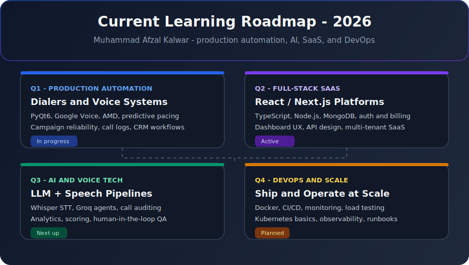

<div align="center">


<br/><br/>

[](#work-with-me)
[](https://mafzalkalwardev.github.io)
[](https://www.linkedin.com/in/muhammad-afzal-2670b527b/)
[](mailto:kalwarmuhammadafzal3@gmail.com)

<br/>


</div>

---

## About Me

I am **Muhammad Afzal Kalwar**, a **Full-Stack Developer** and **Python Automation Engineer** based in **Islamabad, Pakistan**, working with clients and teams remotely.

I build practical software for business workflows: CRM dashboards, auto dialers, email tools, web scrapers, internal automation, and AI-assisted voice/data products. My background is a **B.S. in Computer Science from Air University, Islamabad**, and my GitHub is focused on shipped projects rather than toy examples.

| Focus | What I build |
|:--|:--|
| Web apps and SaaS | React, Next.js, Node.js, FastAPI, dashboards, auth, APIs |
| Python desktop tools | PyQt6 apps, Windows utilities, Excel/data workflows |
| Automation | Playwright, Selenium, scraping, CRM integration, lead workflows |
| Communications | Auto dialers, Google Voice tooling, SMTP, email verification |
| AI and voice | Whisper, Groq, transcription, call scoring, analytics prototypes |

---

## Education

<table>
<tr>
<td width="72" valign="top">

</td>
<td valign="top">

**Bachelor of Science in Computer Science** - **Air University, Islamabad** - *Graduated*

Algorithms, software engineering, databases, operating systems, computer networks, and systems programming.

</td>
</tr>
</table>

---

## Work With Me

| | |
|:--|:--|
| Roles | Full-Stack Developer, Python Engineer, Automation Engineer |
| Availability | Freelance, contract, part-time, full-time remote |
| Location | Islamabad, Pakistan - remote worldwide |
| Portfolio | [mafzalkalwardev.github.io](https://mafzalkalwardev.github.io) |
| Contact | [Email](mailto:kalwarmuhammadafzal3@gmail.com) - [LinkedIn](https://www.linkedin.com/in/muhammad-afzal-2670b527b/) |

Common project types: auto dialers, CRM tools, dispatch websites, email verification platforms, web scrapers, admin dashboards, API integrations, and Excel/data automation.

---

## Featured Projects

| Project | Best description | SEO tags |
|:--|:--|:--|
| [Indus Transport Auto Dialer](https://github.com/mafzalkalwardev/indus-transport-auto-dialer) | Production Windows auto dialer for dispatch teams with Google Voice browser automation, Excel campaign import, resume-safe calling, local logs, and PyQt6 desktop UI. | `python` `pyqt6` `auto-dialer` `google-voice` `telephony` `dispatch-software` |
| [Bulk Email Verifier](https://github.com/mafzalkalwardev/bulk-email-verifier) | Self-hosted bulk email verification platform with syntax, MX, SMTP mailbox checks, Node.js UI, Go verification services, and Docker deployment. | `email-verification` `smtp` `go` `nodejs` `docker` `self-hosted` |
| [Fiverr Lead Extractor CRM](https://github.com/mafzalkalwardev/fiverr-lead-extractor-crm) | Full-stack lead extraction CRM for Fiverr review research with Playwright workers, MongoDB, BullMQ queues, Excel export, admin dashboard, and Electron desktop packaging. | `crm` `lead-generation` `playwright` `typescript` `mongodb` `electron` |
| [CallAudit-X](https://github.com/mafzalkalwardev/CallAudit-X) | AI call auditing SaaS for transcription, quality scoring, review workflows, analytics dashboards, and call-center performance insights. | `ai` `call-analytics` `saas` `transcription` `nextjs` `typescript` |
| [Google Voice Dispatch Agent](https://github.com/mafzalkalwardev/google-voice-dispatch-agent) | Selenium-based Google Voice dispatch assistant with Groq-generated call scripts, local TTS, voicemail handling, and low-cost outbound workflow automation. | `python` `selenium` `google-voice` `voice-automation` `groq` `dispatch` |
| [Playwright Scraper Pro](https://github.com/mafzalkalwardev/playwright-website-scraper-pro) | Advanced website scraping and cloning toolkit with Playwright automation, desktop GUI, Express backend, screenshots, asset downloading, and multi-page export. | `playwright` `web-scraping` `nodejs` `express` `desktop-gui` `automation` |

[View more projects on my portfolio](https://mafzalkalwardev.github.io/projects.html)

---

## Current Learning Roadmap

<div align="center">



</div>

| Quarter | Focus | What I am strengthening |
|:--|:--|:--|
| Q1 | Production automation | PyQt6 dialers, Google Voice workflows, campaign reliability, CRM operations |
| Q2 | Full-stack SaaS | TypeScript, React/Next.js, Node.js APIs, MongoDB, authentication, billing |
| Q3 | AI and voice systems | Whisper, Groq agents, call auditing, analytics, human review workflows |
| Q4 | DevOps and scale | Docker, CI/CD, monitoring, load testing, Kubernetes fundamentals |

---

## Tech Stack

<div align="center">

**Languages**


**Frontend and desktop**


**Backend and data**


**Automation, AI, and DevOps**


<br/><br/>


</div>

---

## Repository Highlights

| Category | Repositories |
|:--|:--|
| Dialers and voice | [indus-transport-auto-dialer](https://github.com/mafzalkalwardev/indus-transport-auto-dialer), [google-voice-dispatch-agent](https://github.com/mafzalkalwardev/google-voice-dispatch-agent), [python-auto-dialer-pro](https://github.com/mafzalkalwardev/python-auto-dialer-pro) |
| Email platforms | [bulk-email-verifier](https://github.com/mafzalkalwardev/bulk-email-verifier), [mailforge](https://github.com/mafzalkalwardev/mailforge), [email-verifier-pro](https://github.com/mafzalkalwardev/email-verifier-pro) |
| Web and CRM | [fiverr-lead-extractor-crm](https://github.com/mafzalkalwardev/fiverr-lead-extractor-crm), [CallAudit-X](https://github.com/mafzalkalwardev/CallAudit-X), [sms-marketing-crm](https://github.com/mafzalkalwardev/sms-marketing-crm) |
| Scrapers and data | [playwright-website-scraper-pro](https://github.com/mafzalkalwardev/playwright-website-scraper-pro), [fmcsa-safer-scraper](https://github.com/mafzalkalwardev/fmcsa-safer-scraper), [excel-mc-data-cleaner](https://github.com/mafzalkalwardev/excel-mc-data-cleaner) |
| All repositories | [Browse GitHub repositories](https://github.com/mafzalkalwardev?tab=repositories) |

---

---

---

## GitHub Achievements & Highlights

<div align="center">

### Achievements

<a href="https://github.com/mafzalkalwardev?tab=achievements" title="Pull Shark">
  
</a>
<a href="https://github.com/mafzalkalwardev?tab=achievements" title="Pair Extraordinaire">
  
</a>
<a href="https://github.com/mafzalkalwardev?tab=achievements" title="YOLO">
  
</a>
<a href="https://github.com/mafzalkalwardev?tab=achievements" title="Quickdraw">
  
</a>
<a href="https://github.com/mafzalkalwardev/indus-transport-auto-dialer/discussions" title="Galaxy Brain">
  
</a>

<br/>

[](https://github.com/mafzalkalwardev?tab=achievements)
[](https://github.com/mafzalkalwardev?achievement=pull-shark&tab=achievements)
[](https://github.com/mafzalkalwardev?tab=repositories)

### Highlights

| Highlight | Status |
|:--|:--|
| **GitHub Pro** | Active |
| **Developer Program Member** | Active |
| **GitHub Campus Expert** | [Apply here](https://education.github.com/experts) if you are a student |
| **Public Sponsor** | [Sponsor any maintainer publicly ($1+)](https://github.com/sponsors) for the badge |
| **Galaxy Brain** | Answer discussions — see [Auto Dialer Q&A](https://github.com/mafzalkalwardev/indus-transport-auto-dialer/discussions) |

</div>

---

## GitHub Stats

<div align="center">


<br/>


<br/>


</div>

---

## Contribution Snake

<div align="center">

<picture>
  <source media="(prefers-color-scheme: dark)" srcset="https://raw.githubusercontent.com/mafzalkalwardev/mafzalkalwardev/output/github-contribution-grid-snake-dark.svg" />
  <source media="(prefers-color-scheme: light)" srcset="https://raw.githubusercontent.com/mafzalkalwardev/mafzalkalwardev/output/github-contribution-grid-snake.svg" />
  
</picture>

</div>

---

## At a Glance

```python
class MuhammadAfzalKalwar:
    name = "Muhammad Afzal Kalwar"
    title = "Full-Stack Developer & Python Automation Engineer"
    education = "B.S. Computer Science - Air University, Islamabad"
    location = "Islamabad, Pakistan - Remote worldwide"
    status = "Open to freelance, contract, and remote roles"

    stack = [
        "Python", "TypeScript", "Go", "React", "Node.js",
        "PyQt6", "Playwright", "FastAPI", "Docker", "MongoDB",
    ]

    portfolio = "https://mafzalkalwardev.github.io"

    def contact(self):
        return "kalwarmuhammadafzal3@gmail.com"
```

---

<div align="center">

<h2><strong>Building systems that automate workflows and solve real-world business problems.</strong></h2>


[Email me](mailto:kalwarmuhammadafzal3@gmail.com) - [Portfolio](https://mafzalkalwardev.github.io) - [LinkedIn](https://www.linkedin.com/in/muhammad-afzal-2670b527b/)


</div>

<details>
<summary><strong>Search keywords</strong></summary>

Muhammad Afzal Kalwar, mafzalkalwardev, Python developer, full-stack developer, automation engineer, freelance developer, remote developer, Islamabad Pakistan, Air University, auto dialer, email verification, Playwright, PyQt6, React, Node.js, FastAPI, CRM tools, web scraping, Google Voice automation, AI call auditing, SaaS dashboards, dispatch software, lead generation CRM.

</details>
