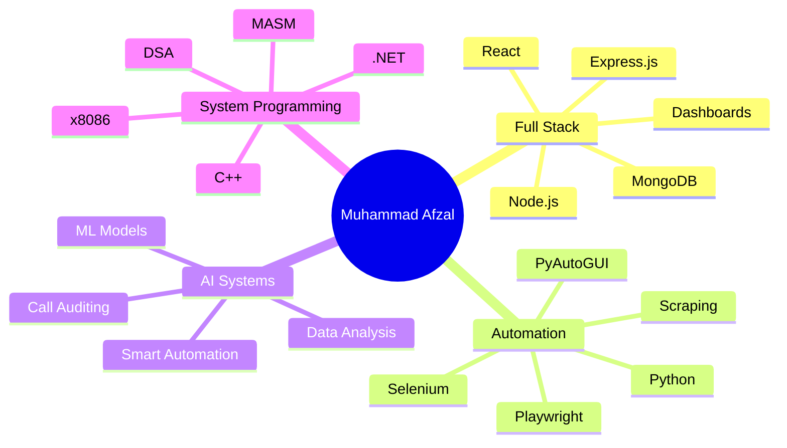

<div align="center">


<br/>

<a href="https://github.com/mafzalkalwardev">
  
</a>
<a href="https://www.linkedin.com/in/muhammad-afzal-2670b527b/">
  
</a>
<a href="https://www.industransports.online/">
  
</a>

<br/><br/>


</div>

---

# 👨‍💻 About Me

I am **Muhammad Afzal Kalwar**, a **Full-Stack Developer, Automation Engineer, and AI Enthusiast** building practical software for real-world business workflows.

My work focuses on **AI-powered tools, web automation, data extraction, CRM systems, logistics technology, email automation, dashboards, and full-stack web platforms**.

```yaml
name: Muhammad Afzal Kalwar
username: mafzalkalwardev
role: Full-Stack Developer | Automation Engineer | AI Enthusiast

core_domains:
  - AI-powered automation
  - Web scraping and browser automation
  - Full-stack web applications
  - Logistics and dispatch software
  - CRM and admin dashboards
  - Email verification and outreach systems
  - Data extraction pipelines
  - Desktop automation tools

expanding_into:
  - .NET development
  - C++ projects
  - Data Structures and Algorithms
  - MASM / x8086 Assembly
  - Advanced system-level programming
```

---

# 🚀 Engineering Identity

<table>
<tr>
<td width="33%">

## 🤖 Automation

I build systems that reduce manual work and automate repetitive workflows.

* Browser automation
* Scraping pipelines
* Verification workflows
* Auto dialers
* Email automation
* SMS automation
* Resume/retry systems

</td>
<td width="33%">

## 🌐 Full Stack

I build complete applications from UI to database and backend logic.

* Dashboards
* CRMs
* Admin panels
* Auth systems
* APIs
* MongoDB apps
* Business platforms

</td>
<td width="33%">

## 🧠 AI & Data

I explore AI-powered tools, analytics, and intelligent workflow systems.

* AI call auditing
* Data extraction
* ML projects
* AI-assisted automation
* Analytics dashboards
* Classification systems

</td>
</tr>
</table>

---

# 🏆 Featured Projects

<table>
<tr>
<td width="50%">

## 🔥 CallAudit-X

**AI-powered call auditing and analytics platform.**

A business-focused system built for call analysis, scoring, transcription workflows, and performance insights.

**Key Features**

* AI call analysis
* Call scoring
* Transcription workflows
* Analytics dashboard
* SaaS-style structure
* Business reporting

**Tech Area**

`AI` `Analytics` `TypeScript` `SaaS` `Dashboard`

</td>
<td width="50%">

## 🎯 Fiverr Lead Extractor CRM

**Advanced Fiverr scraping, lead extraction, and CRM automation system.**

Built for extracting Fiverr gig/review data, filtering leads, storing records, exporting Excel sheets, and managing automation workflows.

**Key Features**

* Fiverr review scraping
* Playwright automation
* CRM dashboard
* MongoDB storage
* Excel export
* Resume/retry engine
* Automated verification workflow
* Worker queue architecture

**Tech Area**

`Playwright` `TypeScript` `MongoDB` `BullMQ` `Electron` `Automation`

</td>
</tr>

<tr>
<td width="50%">

## 📞 Python Auto Dialer Pro

**Desktop automation tool for structured calling workflows.**

Built to automate contact loading, dialing, logging, and resume-based call management.

**Key Features**

* Excel contact import
* Auto dialing workflow
* Desktop GUI
* Call logs
* Resume support
* PyAutoGUI automation
* Keyboard shortcuts

**Tech Area**

`Python` `Tkinter` `PyAutoGUI` `Excel Automation`

</td>
<td width="50%">

## 🕷 Playwright Website Scraper Pro

**Website scraping and cloning automation system.**

Built for multi-page scraping, asset downloading, screenshots, exporting website data, and GUI-based automation control.

**Key Features**

* Multi-page scraping
* Screenshot capture
* Asset downloads
* Website export
* Express backend
* GUI control
* Automation engine

**Tech Area**

`Playwright` `Node.js` `Express.js` `Scraping`

</td>
</tr>

<tr>
<td width="50%">

## 🧪 QuizMaster Online Testing System

**Full-stack online testing platform with student/admin workflows.**

Built with MVC architecture for quiz creation, attempts, results, authentication, and leaderboard features.

**Key Features**

* Quiz management
* Student attempts
* Admin panel
* Authentication
* Leaderboard
* Result analytics
* MongoDB database

**Tech Area**

`Node.js` `Express.js` `MongoDB` `EJS`

</td>
<td width="50%">

## 🧠 MNIST CNN Digit Recognition

**Deep learning project for handwritten digit recognition.**

Built with TensorFlow/Keras to train, evaluate, and test CNN models with GUI prediction support.

**Key Features**

* CNN model
* Model training
* Custom image prediction
* GUI testing
* Accuracy visualization
* ML workflow

**Tech Area**

`Python` `TensorFlow` `Keras` `Deep Learning`

</td>
</tr>
</table>

---

# 🧩 Project Categories

| Category            | Projects / Work                                                                 |
| ------------------- | ------------------------------------------------------------------------------- |
| **AI & Analytics**  | CallAudit-X, MNIST CNN Digit Recognition                                        |
| **Automation**      | Python Auto Dialer Pro, Python SMS Automation, Mouse Coordinate Tracker         |
| **Web Scraping**    | Fiverr Lead Extractor CRM, Playwright Website Scraper Pro, SAFER/FMCSA Scrapers |
| **Logistics Tech**  | Indus Transports Website, Carrier Data Extractors, MC Number Tools              |
| **Email Systems**   | Multi SMTP Email Automation, Email Verification Platform, Email Verifier Pro    |
| **Full-Stack Apps** | QuizMaster Online Testing System, Portfolio, CRM Projects                       |
| **Data Tools**      | PDF MC Extractor, Excel Cleaner, State Extractor Formula                        |
| **Coming Soon**     | .NET apps, C++ DSA projects, MASM/x8086 Assembly projects                       |

---

# 🛠 Tech Stack

## Languages

<p>

</p>

## Frontend

<p>

</p>

## Backend & Database

<p>

</p>

## Automation / AI / Tools

<p>

</p>

---

# ⚙️ Technologies I Work With

<table>
<tr>
<td width="25%">

## Backend

* Node.js
* Express.js
* MongoDB
* MySQL
* REST APIs
* Authentication
* MVC structure
* API integrations

</td>
<td width="25%">

## Frontend

* React
* EJS
* HTML5
* CSS3
* Bootstrap
* Responsive UI
* Dashboards
* Admin panels

</td>
<td width="25%">

## Automation

* Python
* Playwright
* Selenium
* PyAutoGUI
* Web scraping
* Excel automation
* Browser control
* Data extraction

</td>
<td width="25%">

## Learning / Expanding

* .NET
* C#
* C++
* DSA
* MASM
* x8086 Assembly
* System programming
* Advanced algorithms

</td>
</tr>
</table>

---

# 📊 GitHub Analytics

<div align="center">


<br/><br/>


</div>

---

# 🏅 GitHub Trophies

<div align="center">


</div>

---

# 📈 Contribution Graph

<div align="center">


</div>

---

# 🧠 Current Learning Roadmap



---

# 💼 What Makes My Work Different

```python
class MuhammadAfzalKalwar:
    def __init__(self):
        self.role = "Full-Stack Developer & Automation Engineer"
        self.strengths = [
            "building practical business tools",
            "automating repetitive workflows",
            "creating scraping and data extraction systems",
            "developing CRM and dashboard platforms",
            "working with logistics and dispatch technology",
            "combining frontend, backend, automation, and AI"
        ]

    def mission(self):
        return "Build software that saves time, scales operations, and solves real business problems."
```

---

# 🔍 Professional Keywords

<p>


</p>

---

# 📌 Recommended Pinned Repositories

| Priority | Repository Type                  |
| -------- | -------------------------------- |
| 1        | CallAudit-X                      |
| 2        | Fiverr Lead Extractor CRM        |
| 3        | Python Auto Dialer Pro           |
| 4        | Playwright Website Scraper Pro   |
| 5        | QuizMaster Online Testing System |
| 6        | MNIST CNN Digit Recognition      |
| Future   | Best .NET project                |
| Future   | Best C++ DSA project             |
| Future   | Best MASM/x8086 project          |

---

# 🤝 Connect With Me

<div align="center">

<a href="https://github.com/mafzalkalwardev">

</a>

<a href="https://www.linkedin.com/in/muhammad-afzal-2670b527b/">

</a>

<a href="https://www.industransports.online/">

</a>

</div>

---

<div align="center">

## “I build systems that automate work, organize data, and solve real business problems.”


</div>
