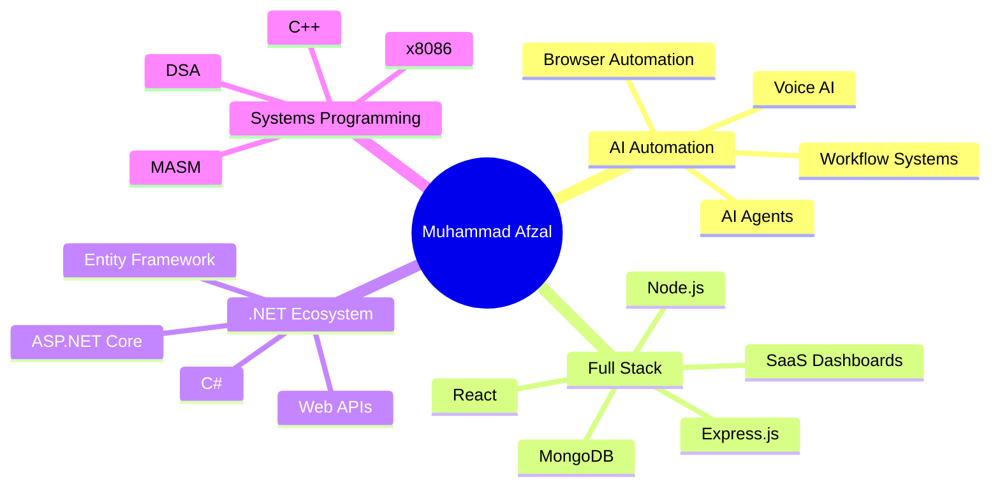

<div align="center">


<br/>

<a href="https://github.com/mafzalkalwardev">

</a>

<a href="https://www.linkedin.com/in/muhammad-afzal-2670b527b/">

</a>

<a href="mailto:kalwarmuhammadafzal3@gmail.com">

</a>

<br/><br/>


</div>

---

# 👨‍💻 About Me

I’m **Muhammad Afzal Kalwar**, a **Full-Stack Developer** and **Automation Engineer** focused on building practical software systems that automate workflows, organize operations, and solve real business problems.

My work combines:

* 🤖 AI-assisted systems
* ⚡ Browser automation
* 🕷 Web scraping pipelines
* 🌐 Full-stack web applications
* 📊 CRM & dashboard systems
* 🚚 Logistics & dispatch technology
* 📧 Email automation workflows
* 🔍 Data extraction systems

---

# 🚀 Featured Projects

<table>
<tr>
<td width="50%">

## 🤖 Google Voice Dispatch Agent

AI-powered dispatch and calling automation system with:

* Browser automation
* Live call workflows
* Voicemail detection
* Speech-to-text / text-to-speech
* CRM workflows
* AI-assisted communication

**Tech:** Python, FastAPI, Selenium, Playwright

</td>
<td width="50%">

## 🎯 Fiverr Lead Extractor CRM

Advanced Fiverr scraping and CRM platform featuring:

* Fiverr review extraction
* Playwright automation
* MongoDB storage
* Excel export
* Resume/retry system
* Automated verification workflow

**Tech:** TypeScript, Playwright, MongoDB

</td>
</tr>

<tr>
<td width="50%">

## 📞 Python Auto Dialer Pro

Desktop automation tool for structured calling workflows.

* Excel contact loading
* Automated dialing
* Call logging
* Resume support
* Desktop automation

**Tech:** Python, Tkinter, PyAutoGUI

</td>
<td width="50%">

## 🕷 Playwright Website Scraper Pro

Website scraping and cloning automation platform.

* Multi-page scraping
* Screenshot capture
* Asset downloading
* Export system
* GUI controls

**Tech:** Playwright, Node.js, Express.js

</td>
</tr>

<tr>
<td width="50%">

## 🧠 CallAudit-X

AI-powered call auditing and analytics platform.

* Call scoring
* Analytics dashboards
* AI call analysis
* SaaS-style architecture

**Tech:** TypeScript, AI Systems

</td>
<td width="50%">

## 🧪 MNIST CNN Digit Recognition

Deep learning project for handwritten digit recognition.

* CNN model training
* GUI prediction system
* TensorFlow workflow
* Custom image testing

**Tech:** Python, TensorFlow, Keras

</td>
</tr>
</table>

---

# 🛠 Tech Stack

### Languages

<p>

</p>

### Frontend

<p>

</p>

### Backend & Database

<p>

</p>

### Automation & Tools

<p>

</p>

---

# 📈 GitHub Analytics

<div align="center">


</div>

---

---

# 🧠 Current Learning Roadmap



---

# 🐍 Contribution Snake

<div align="center">


</div>

---


# 🧠 Currently Exploring

* .NET ecosystem
* C++ systems programming
* Data Structures & Algorithms
* MASM / x8086 Assembly
* AI-assisted automation systems
* Scalable SaaS architecture
* Advanced scraping infrastructure

---

# 💼 Engineering Focus

```python
class MuhammadAfzalKalwar:
    def __init__(self):
        self.role = "Automation Engineer & Full-Stack Developer"

    def build(self):
        return [
            "AI-powered systems",
            "browser automation",
            "web scraping tools",
            "business dashboards",
            "CRM platforms",
            "logistics software",
            "automation pipelines"
        ]

    def mission(self):
        return "Build systems that save time, automate workflows, and solve operational problems."
```

---

# 🔍 Professional Keywords

`Full-Stack Developer`
`Automation Engineer`
`Python Developer`
`Node.js Developer`
`Playwright Automation`
`Web Scraping`
`MongoDB`
`AI Systems`
`CRM Development`
`Business Automation`
`Logistics Software`
`SaaS Development`
`Data Extraction`
`.NET`
`C++`
`DSA`
`MASM x8086`

---

<div align="center">

## ⚡ Building systems that automate workflows and solve real-world business problems.

</div>

<div align="center">


</div>

<div align="center">


</div>
